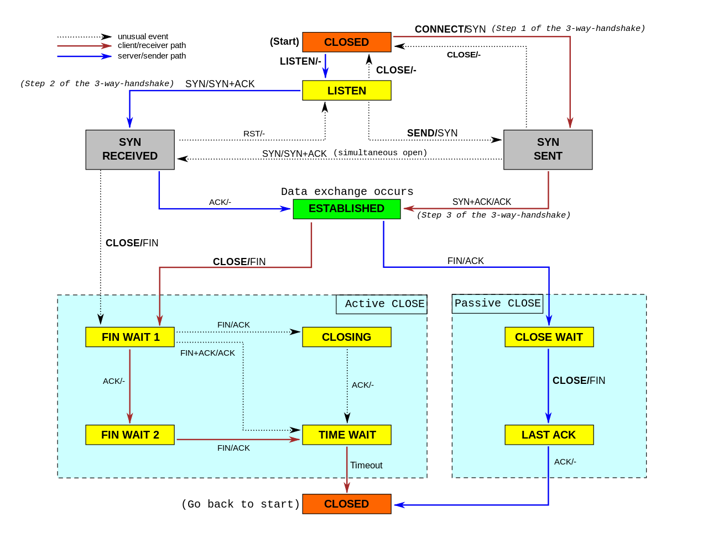

# Table of Contents
- [Table of Contents](#table-of-contents)
    - [What function does DNS play on a network?](#what-function-does-dns-play-on-a-network)
    - [What is HTTP?](#what-is-http)
    - [What are HTTP status codes?](#what-are-http-status-codes)
    - [Describe the most common HTTP methods/verbs](#describe-the-most-common-http-methodsverbs)
    - [What is an HTTP proxy and how does it work?](#what-is-an-http-proxy-and-how-does-it-work)
    - [Describe briefly how HTTPS works.](#describe-briefly-how-https-works)
    - [What is SMTP?](#what-is-smtp)
    - [UDP](#udp)
    - [TCP](#tcp)
    - [What happens when you navigate to an URL?](#what-happens-when-you-navigate-to-an-url)
  - [References](#references)

### What function does DNS play on a network?

It's on the core for any environment, responsible to translate IP addresses into names, **DNS** can also provides a load balancer layer using geolocation, service discovery using SRV entry and a lot of others features, like domain ownership confirmation using TXT entries ( useful to generate SSL certs, for example )

### What is HTTP?

**HTTP** (hypertext transport protocol) it's a protocol that defines how messages are formated and transmitted via web, and what actions webservers and browsers should take in response of various commands.

### What are HTTP status codes?

HTTP status codes are predefined status of the task at the server
- `1xx` - represents informational responses
- `2xx` - represents succesful responses
- `3xx` - represents redirect responses
- `4xx` - represents client errors
- `5xx` - represents server errors

The most commmons status codes are:  
- `200` - SUCCESS/OK
- `201` - CREATED - used by POST or PUT methods
- `304` - NOT MODIFIED - used in conditional GET Request to reduce bandwitdth use
- `400` - BAD REQUEST - This can be due to validation errors or missing input data
- `404` - NOT FOUND - Resource method is not available
- `500` - INTERNAL SERVER ERROR - server threw some exceptions while running the method
- `502` - BAD GATEWAY - Server was not able to get the response from another upstream server

### Describe the most common HTTP methods/verbs

- `GET` - Read only operation, used to fetch detail from the server, downloads
- `POST` - This method is used for the creationg of new resources on the server
- `PUT` - This method is used to update existing resource on the server or to replace the resource,  
  PUT it's indepotent, and POST isn't, with PUT you can update a resource N times, but if you try  
  with post you will create N resources. PUT - can create resources.
- `PATCH` - Applies a partial update to a resource and doesn't create a new resource
- `DELETE` - This method is used to delete the resource on the server
- `TRACE` - Provides a loop back test along the path to the target resource providing a useful debugging mechanism.
- `OPTIONS` - Fetches the list of supported options of resources present on the server.

### What is an HTTP proxy and how does it work?

An HTTP **proxy** it's a service that forwards HTTP connections, for example a user A want's to access a server www.b.com, but for security reasons the user cannot have direct access on internet, so the user's browser will ask for the HTTP proxy to access the website, the webserver from www.b.com will receive a HTTP message from the proxy and will answer as usual, but in the http HEADER from the message will be changed by the HTTP proxy server who will add or change some headers like User-Agent, X-Forwarded-For, used a lot by companies that need to control their users Internet access.

### Describe briefly how HTTPS works.

**HTTPS** use the same HTTP protocol but creates a security layer(tunnel) using SSL/TLS, on top of it, this prevents anyone modify or inspect what's happening inside this tunnel and ensure the client it's communicating with the right server. The SSL handshake is established and after that all HTTP responses are send by. The SSL uses both types of encryption, symmetrical and assymetrical, first when the key exchange happens, a assymetrical encriptions is put in place to the result of the key exchange be a symmetrical encryption.

### What is SMTP?

**SMTP** ( Simple Mail transport protocol) works in the application layer, and uses a process called "store and forward", working close to a MTA (Mail Tranfer Agent), this MTA service sends via SMTP a package with the messages, when this message arrives at the destination, the client will use POP3/IMAP to download it.

### UDP

1. **Message-oriented**:
 
UDP is a message-oriented protocol, and message means chunks of data that are delivered on the internet. UDP only delivers the message, without any handling like split or combine.

More specifically:  

- At the sender's end，when a UDP message is sent, the UDP protocol will get the data from the application layer, and it will only add the UDP header to the data, nothing else, then deliver it to the network layer.

- At the receiver's end，when getting a UDP message from the network layer, the UDP protocol will only remove the additional IP header on data without any other operations.   

2.  **Unreliable**:

- UDP is connectionless, communication happens without connecting or disconnecting;
- UDP is unreliable, it will deliver whatever it has got, no cache is involved and it does not care about the delivery.
- UDP has no congestion control, data is sent at a constant speed. Even if the network is terrible, it will not adjust the speed, so it is inevitable to lose some packets. However it has the advantage of real-time applications, for example we will use UDP instead of TCP in telephone conference.

3. **Efficient**:  
 
Since there is no guarantee of delivery and no promise that data is not lost and arrives in orderly in UDP, it is not as complicated as TCP. It does not cost a lot in its header data with only 8 bytes, much less than TCP whose head data needs at least 20 bytes. So it can transport data efficiently.

The UDP header consists of 4 fields:

- two port number of 16 bits, source port (optional) and destination port
- the length of the data
- checksum (IPv4 optional) which is used for error-checking of the header and the data.

4. **Transmission mode**:  
 
The transmission modes of UDP contains not only one-to-one, but also one-to-many, many-to-many, and many-to-one, which means UDP supports unicast, multicast and broadcast.

---

### TCP

1. **Header**:  
The header of TCP is much more complicated than UDP's:

When talking about the header of TCP, these fields are significant:

- Sequence Number: This number can guarantee that all the segments are ordered, and the opposite host can order the segments by it.
- Acknowledgment Number: This number indicates the next segment number that the opposite host expects, and everything before this has been received.
- Window Size: How many segments can the opposite host accept; it is used to control the flow.
- Identifier
  - URG=1: When this flag is set, that means this segment is urgent and should be prioritised.
  - ACK=1: Besides according to the TCP protocol, after connection, all the segments that transported should set the ACK=1.
  - PSH=1: When this flag is set, it means that the receiver should push the data to the application layer instead of store it in the caches until the cache is full.
  - RST=1: When this flag is set, it means that the TCP connection has a serious problem. It may need to reconnect. It also can be used to refuse invalid segments or requests.
  - SYN=1: When SYN is 1 and ACK is 0, it means that this is a connect request segment, while SYC is 1 and ACK is 1, it is a response that agrees to connect.
  - FIN=1: When this flag is set, it means that this is a request segment that asks for closing the connection.

2. **State machine**:  

HTTP is stateless, so TCP which is under the HTTP is also stateless. It seems like that TCP links two ends, client and server, but it is actually that both these two ends maintain the state together:

The state machine of TCP is very complicated, and it is closely related to the handshake of opening and closing a connection. Now we'll talk something about these two kinds of handshake. Before that, you'd better know something about RTT(Round-Trip-Time), an important index of performance. It is the time it takes for a signal to be sent plus the time it takes for an acknowledgement of that signal to be received.

3. **Three-way handshake**

In TCP, the end which is active open is called the client and the passive open is called the server. No matter client or server can send and receive data after connection, so TCP is a bi-directional communication protocol. At first, both ends are closed. Before communication, both of the ends will create the TCB(TCP Control Block). After that, the server will be in the LISTEN state and begin to wait for the data from the client.

- **First handshake**

The client sends a connect request which contains an SYN. After that, the client is in the status called `SYN-SENT`.

- **Second handshake**

After getting the request, the server will send a response if it agrees to establish a connect and then turn to `SYN_RECEIVED`. There is also an SYN in the response.

- **Third handshake**

When the client receives the agreement of establishing a connection, it needs to send an acknowledgement. After that the client turns to `ESTABLISHED`, and the server turns to the same state after receiving the acknowledgement. The connection is established successfully by now.

### What happens when you navigate to an URL?

1. Do the DNS query first, it will offer the most suitable IP address with the intelligent DNS parsing.
2. The following is the TCP handshake. The application layer will deliver the data to the transport layer where the TCP protocols will point out the ports of both ends, and then transport the data to the network layer. The IP protocols in the network layer will determine the IP address and how to navigate to the router, and then the packet will be packaged to data frames. And at last is the physical transport.
3. After the TCP handshake is the TLS handshake, and then is the formal data transport. 
4. It is possible for the data to go through the load balancing servers before its accesses to the server. The load balancing server will deliver the requests to the application servers and response with an HTML file.
5. After getting the response, the browser will check the status code, it will continue parsing the file with the status code 200. As for 400 or 500, it will throw an error. If there is 300 code, it will redirect to a new URL. And there is also a redirection counter to avoiding too much redirection by throwing an error.
6. The browser will parse the file, do decompression if the file type is with compressions like gzip and then parse the file by the encoding type. 
7. After the successful parsing, the render flow will start formally. It will construct the DOM tree by HTML and construct the CSSOM with CSS. If there is a `script` tag, browser will check it whether has the `async` or `defer` attributes, the former will download and execute the JS file in parallel, and the latter will load the file first then wait to execute until the HTML has been parsed. If none of them, it will block the render engine until the JS file has been executed. HTTP/2 may highly improve the download efficiency for pictures.
8. The `DOMContentLoaded` event will be triggered after the initial HTML has been loaded and parsed completely.
9. The Render tree will be constructed following the CSSOM and the DOM tree, in which the layout of page elements, styles and so on will be calculated.
10. In the process of constructing the Render tree, the browser will call the GPU to paint, composite the layers and display the contents on the screen.

## References
 - https://github.com/gracco/sysadmin-interview-questions
 - https://github.com/InterviewMap/CS-Interview-Knowledge-Map/blob/master/Network/Network_en.md
    